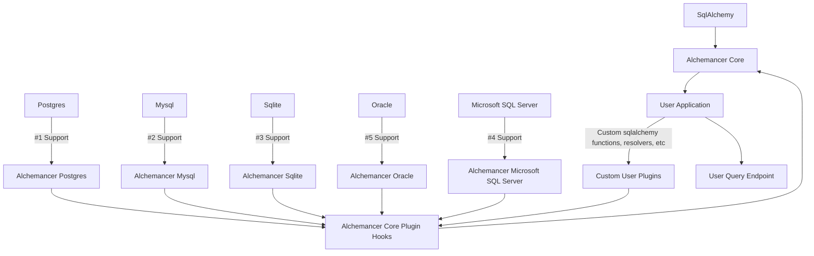

TODO:<br>
--- Ordered by priority ---
1) ~~SubQueries~~
   1) ~~Basic support has been implemented~~
   2) Need more tests 
2) ~~CTEs~~
3) ~~Resolvers~~
   1) ~~Need to evaluate path forward, Temp tables VS literal subqueries~~
   2) Went with temp tables, implemented basic version, we can always do the other one if we need it. 
4) Plugin systems
   1) Plugin is a bit of a misnomer here, this is more of a module system. 
There are configurable slots and you can plugin in modules to the slots, this is more for core maintainers of Alchemancer 
than end users. We utilize this paradigm to enable support for like top level features that have 
different underlying implementation details
   1) JSON query support
   2) Rule system to allow/deny access to fields based on user roles
5) Query cataloguing logic (Handle computing hashs for a query so you can catalogue them by hash. Hashing implementation should focus on query shape and strip out params)
6) Query permissions system
   1) This is a rule system that allows you to define rules for which tables and columns are accessible based on user roles / permissions. 
   You can use this system to restrict access to certain tables or columns based on the user's role.
7) Query limiting configuration
   1) This is a configuration system that allows implementors to specify default limits for certain models in their database to prevent returning too much data.
8) User Docs
9) Implementer Docs
10) Tutorials
11) FastAPI example
12) Django example
13) Flask example

# Resolver Support

Required Features:

|          | Temp Tables | CTE / Literal Subquery |   |   |
|----------|-------------|------------------------|---|---|
| Postgres | ✔ ️         |                        |   |   |
| Sqlite   | ?          |                        |   |   |
| MySQL    | ✔          |                        |   |   | 
| MsSql    | ✔          |                        |   |   |
| Oracle   | ✔          |                        |   |   |

# JSON Support

|          | JSON |
|----------|------|
| Postgres | ✔ ️  |
| Sqlite   | ✔    |
| MySQL    | ✔    | 
| MsSql    | ✔    |
| Oracle   | ✔    |

# Package structure
```
---> Core (alchemancer)
|
|------Postgres (alchemancer[postgres]) ----|---------- Flask (Pure Sqlalchemy)
|------Sqlite (alchemancer[sqlite]) --------|
|------MySQL (alchemancer[mysql]) ----------|---------- Django
|------MsSql (alchemancer[mssql]) ----------|
|------Oracle (alchemancer[oracle]) --------|---------- FastAPI
```



## FAQ
1) Does this library expose my database connection info to clients?
   - No, the library does not expose any database connection info to clients. The library is designed to be used in 
   a server-side application where the database connection info is kept secure and not exposed to clients.
2) Does this library expose the ability to insert, update or delete records in my database?
   - No, this library is only designed to expose read-only access to your database. The library does not provide any
   functionality for inserts, updates or deletes. If that is needed please use sqlalchemy directly.
3) How do I prevent users from accessing certain tables or columns?
   - The library provides a rule system that allows you to define rules for which tables and columns are accessible 
   based on user roles. You can use this system to restrict access to certain tables or columns based on the user's 
   role.
4) How do I prevent DOS attacks when using this library?
   1) There will be a query limit configuration system that allows implementors to specify default limits for certain 
   models in their database to prevent returning too much data.
   2) You should also consider leveraging authorization, authentication and rate limiting on your API endpoints to prevent DOS attacks.
